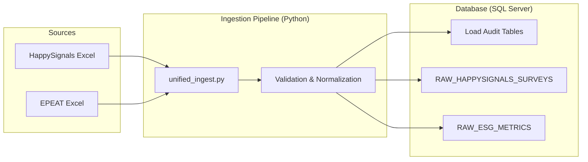

# UXM Dashboard: Data Flow & Project Overview

This document provides a technical overview of the data ingestion pipeline and database structure for the UI developer building the UXM Dashboard.

## 1. Project Objective
The goal is to provide a unified view of **User Experience (HappySignals)** and **ESG/Sustainability (EPEAT)** metrics. Data is ingested from Excel sources into a SQL Server database, which serves as the backend for the dashboard.

---

## 2. High-Level Data Flow

---

## 3. Database Schema (ExpNXT Schema)

### 3.1 HappySignals Surveys
**Table**: `ExpNXT.RAW_HAPPYSIGNALS_SURVEYS`
Used for tracking end-user satisfaction and productivity loss.

| Column | Type | Description |
| :--- | :--- | :--- |
| `survey_id` | VARCHAR | Unique ID (generated during ingestion). |
| `happiness_score` | DECIMAL | 0-10 score of user satisfaction. |
| `lost_time_minutes` | INT | Estimated time lost due to IT issues. |
| `burnout_risk_score`| DECIMAL | Risk level indicator. |
| `respondent_email` | VARCHAR | User email (can be used for joins). |
| `department`, `location`, `country`, `role` | VARCHAR | Metadata for filtering and grouping. |
| `created_date` | DATETIME | When the survey was submitted. |

### 3.2 ESG Metrics (EPEAT)
**Table**: `ExpNXT.RAW_ESG_METRICS`
Used for tracking environmental impact and energy efficiency.

| Column | Type | Description |
| :--- | :--- | :--- |
| `device_model` | VARCHAR | The hardware model name. |
| `epeat_rating` | VARCHAR | Gold, Silver, or Bronze rating. |
| `co2_emissions_kg` | DECIMAL | Estimated CO2 impact. |
| `energy_star_rating`| VARCHAR | Efficiency rating. |
| `lifecycle_kg_co2` | INT | Total lifecycle carbon footprint. |
| `material_composition`| JSON string | Details about manufacturer and categories. |

### 3.3 Audit & Freshness
**Tables**: `ExpNXT.load_audit` and `ExpNXT.esg_load_audit`
Check these tables to show "Last Updated" or "Refresh Status" in the UI.

- `status`: `COMPLETED`, `STARTED`, or `FAILED`.
- `end_ts`: The timestamp when the last ingestion finished.
- `rows_inserted`: Number of records processed.

---

## 4. Key Logic for UI
- **Data Uniqueness**: `survey_id` (HappySignals) and `device_model` (EPEAT) are used for upserts.
- **Fuzzy Matching**: In the EPEAT ingestion, we use fuzzy matching to map raw product names to a standard inventory. The UI should be prepared for various device model names.
- **Filtering**: The dashboard should allow filtering by `Country`, `Department`, and `Top Company` (for HappySignals) and `Manufacturer` (extracted from EPEAT JSON).

## 5. Getting Started
- **Connection**: Use the connection string in the `.env` file to connect to the SQL Server.
- **Queries**: You can query the `RAW_*` tables directly for the dashboard widgets.
